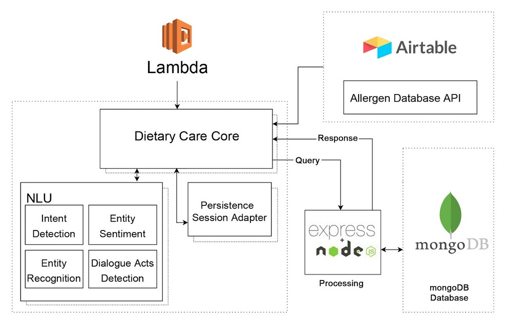
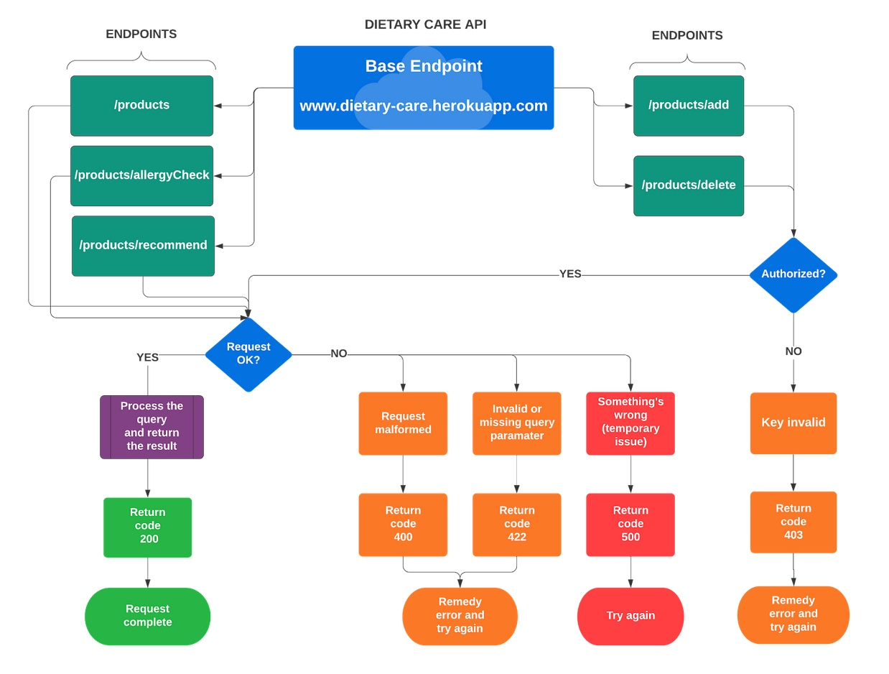

<div align="center">
<h1 align="center">Dietary Care</h1>
<br />
<br>
<br>
A voice-based chatbot that helps the users in selecting food products taking into account their food allergies, supports fallback intents for continuous conversation and store user allergens in persistent storage for future sessions.
</div>

## Application Workflow
1. Session initiation and fetching of user allergen values from allergenDB
2. allergenDB update via POST request and invoking the productCheckIntent
3. Getting isAllergic value from the backend server
4. Invoking productCheckIntent again to check for another product
5. Based on the user allergies, advised not to consume the product
6. Recommendation mail send and session is ended
[![[application_workflow]](assets/application_workflow.jpg)](https://www.figma.com/file/Y1cey4FqV5dnhfwwkMzQ4u/Dietary-Care?node-id=0%3A1&t=Y6TV2HfNedVfbvcx-1)

## System Architecture

## API Design


## API Endpoints
```json
{
   "status":200,
   "message":"Welcome to dietary-care food products API",
   "valid_endpoints":[
      {
         "endpoint":"/products",
         "method":"GET",
         "description":"Displays all products"
      },
      {
         "endpoint":"/products/allergyCheck",
         "method":"POST",
         "description":"Lets you check if you are allergic to a certain product"
      },
      {
         "endpoint":"/products/add",
         "method":"POST",
         "description":"Lets you add a product to the database"
      },
      {
         "endpoint":"/products/recommend",
         "method":"POST",
         "description":"Get product recommendation based on query parameters"
      }
   ]
}
```

## Contributing
Feel free to reach out, if intetested in taking this project forward.

## License
This project is licensed under the MIT license